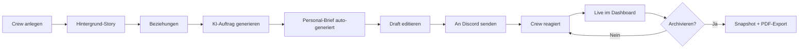

<div align="center">

# 🎭 SEKT6R — Crime Automation

**KI-gestütztes Admin-Tool für GTA-V Roleplay-Server**

Generiert atmosphärische Crime-Aufträge per KI, verteilt sie über Discord an Gang-Channels und verfolgt Reaktionen im Live-Dashboard. Inklusive Personal-Bedarf-Planung, Mittler-System und automatischer Konsistenz-Prüfung.


[Features](#-features) · [Installation](#-installation) · [Dokumentation](#-dokumentation) · [Screenshots](#-screenshots)

</div>

---

## 🚀 Was ist das?

Ein vollständiges **Admin-Backend für Roleplay-Communities**, das den Spielleiter-Aufwand drastisch reduziert. Statt jeden Auftrag manuell zu schreiben, generiert eine KI atmosphärische Briefings auf Basis von Gang-Story und Beziehungen — und ein Discord-Bot verteilt sie automatisch an die richtigen Channels.

**Zielgruppe:** RP-Server-Owner (FiveM, RedM, eigenständige Communities), die professionelles Crime-Auftragsmanagement ohne Schreib-Marathons wollen.

```
┌────────────────────────────────────────────────────────┐
│  Spielleiter klickt "Generieren"                       │
│         ↓                                              │
│  KI schreibt atmosphärischen Crime-Auftrag             │
│  + automatischen Personal-Bedarf (NPCs/Mittler)        │
│         ↓                                              │
│  Discord-Bot postet im Crew-Channel                    │
│  + Personal-Briefing im Spielleiter-Channel            │
│         ↓                                              │
│  Crew reagiert mit 👍 / 👎 / ❌                          │
│         ↓                                              │
│  Live-Update im Dashboard + Ranking-Punkte             │
└────────────────────────────────────────────────────────┘
```

## ✨ Features

### KI-Auftrags-Generierung
- 🤖 **Anthropic Claude + OpenAI** als Provider (umschaltbar)
- 📝 **Story-bewusste Generierung** — KI nutzt Gang-Background, Beziehungen, Mission-Historie
- 🔁 **Drei Modi**: Frei generiert · Roh-Input umschreiben · Manueller Klartext
- ✂️ **Auto-Cleaner**: entfernt Pseudo-Aktennummern, Reaktions-Aufforderungen, wandelt Zahlwörter zu Ziffern
- ⏰ **Server-Zeitfenster** — KI respektiert Aktivitätszeiten der Community
- 💬 **Multiple System-Prompts** speicherbar, eine aktivierbar

### Discord-Bot („Il Padrino")
- 📤 **Automatischer Versand** an Crew-Channels mit Embeds und Reaktionen
- ⏳ **Scheduled-Send** — Bot-Watcher sendet zur geplanten Zeit
- 🎙 **Boss-Feedback-Polling** aus separatem Zusatzinfo-Channel
- 🔄 **Replace-Previous-Pattern** für Ranking-Posts (immer aktuell, kein Spam)
- 📊 **Tägliche Ranking-Embeds** — Top-3-Hype + Gesamt-Ranking

### Personal-Bedarf-System ⭐ NEU
- 🎭 **Auto-Generierung** von NPC- und Mittler-Briefings parallel zum Auftrag
- 👥 **15 NPC-Archetypen** (Hafenmeister, Politiker, Bankleiter, etc.) als Pool
- 📋 **6 Massen-Auftrag-Templates** (Tag 2/4/7/9/10) für Event-Kampagnen
- 📤 **Auto-Post in Spielleiter-Channel** beim Mission-Send
- 🖥 **Live-Dashboard-Widget** mit 30 s Polling + Browser-Notifications
- ✎ **Inline-Editor** auf Crew-Seite und Dashboard

### Mittler-Verwaltung ⭐ NEU
- 👤 **Read-Only-Übersicht** der Quest-Geber (Miguel, Maklerin, Pater, Fixer, Witwe, Skrupellose)
- ✎ **In-Page-Editor** mit Quick-Insert für neue Mittler
- 🔍 **KI-Konsistenz-Check** — vergleicht Mittler-Profile mit aktueller Event-Story
- 🤖 **Auto-Apply pro Empfehlung** — KI macht die Edit, du bestätigst im Split-Screen-Preview
- 💾 **Auto-Backups** als `.bak` vor jeder Änderung

### Crew/Gang-Management
- 🏘 **Stadtteil-Zuordnung** (Algonquin, Bohan, Broker, Colony Island, Dukes)
- 🔗 **Beziehungs-Editor** (allied / rival / hostile / business / neutral) → KI nutzt das als Story-Treiber
- 🎨 **Crew-Farben** für visuelle Unterscheidung
- ⭐ **Bonus-Punkte** — manuell +/− im Crew-Detail
- 💼 **Crime-Business-Hinweise** als KI-Kompass (intern, nicht im Auftrag sichtbar)

### Live-Dashboard
- 📈 **Reaktions-Statistik** mit Stadtteil/Crew/Zeitraum-Filtern
- 🎯 **Klick-Filter** — Status-Kachel anklicken filtert die Crew-Liste
- 🔔 **Notifications** — Crew-Karten pulsieren bei neuem Boss-Feedback
- 🔄 **Auto-Refresh** alle 5 Sekunden
- 🚀 **Massen-Auftrag-Versand** — alle/Stadtteil/manuelle Auswahl mit parallelem Dispatch

### Ranking-System
- 🏆 **Eigene Seite** mit vollständigem Crew-Ranking
- 🥇 **Top-3 mit Gold/Silber/Bronze**
- 📊 **Punkte-Formel**: `approved × 2 + rejected × −1 + bonus_points`
- ⏱ **Zeitraum-Filter** (Heute / 7 Tage / 30 Tage / Gesamt)
- 🔄 **Reset-Stichtag** mit doppeltem Confirm
- 📅 **Tägliche Discord-Posts** mit dynamischen Titeln (Pool)

### Story-Editor
- 📝 **Whitelist-basierter Markdown-Editor** für Kern-Story-Files
- 💾 **Auto-Backup** als `.bak`
- 📚 **8 Story-Dokumente** editierbar (Briefing, Timeline, Finale, etc.)
- 🎭 **Mittler-Tab** mit eigener Edit-Ansicht

### Archiv & Export
- 📦 **Soft-Delete** mit Snapshot des Boss-Feedbacks vor Discord-Cleanup
- 📄 **PDF-Export** pro Mission (reportlab)
- 🗂 **Globale Archive-Page** mit Crew-Filter
- 🔄 **Restore** und endgültiges Löschen

## 🏗 Tech-Stack

| Schicht | Technologie |
|---|---|
| **Backend** | Python 3.11+/3.14, FastAPI, SQLAlchemy 2 async, SQLite + aiosqlite |
| **Discord-Bot** | discord.py 2.5+ als eigener Prozess (HTTP-API auf 127.0.0.1:8001) |
| **Frontend** | Vanilla HTML + Alpine.js + Tailwind CSS (CDN, kein Build-Step) |
| **KI-Provider** | Anthropic SDK (Claude) + OpenAI SDK (GPT) |
| **PDF** | reportlab |
| **Auth** | HTTP-Basic Auth, lokal auf 127.0.0.1 |
| **Markdown** | marked.js + Mini-Fallback-Renderer |
| **Service-Mgmt** | NSSM (Windows-Services, Auto-Start beim Boot) |

## 📦 Installation

### Voraussetzungen

- Python 3.11–3.14 im PATH
- Discord Bot Application ([Anleitung in CONFIGURATION.md](docs/CONFIGURATION.md#discord-bot-einrichten))
- API-Key für Anthropic Claude und/oder OpenAI

### Quick-Start

```bash
# Repo clonen
git clone https://github.com/RDanton21/CrimeJobs-Handler-Liberty-City.git
cd CrimeJobs-Handler-Liberty-City

# Setup (Windows)
scripts\setup.bat

# Setup (Linux/macOS)
python -m venv .venv
source .venv/bin/activate
pip install -r requirements.txt
cp .env.example .env
```

### `.env` Minimal-Konfiguration

```env
DISCORD_BOT_TOKEN=<dein bot token>
ADMIN_USERNAME=admin
ADMIN_PASSWORD=<starkes passwort>

# Optional — kann auch im Web-UI gesetzt werden
ANTHROPIC_API_KEY=
OPENAI_API_KEY=
```

### Starten

```bash
# Windows — beide Prozesse parallel
scripts\run_all.bat

# Linux/macOS — separate Terminals
python -m uvicorn backend.main:app --host 127.0.0.1 --port 8000
python -m backend.bot
```

Browser öffnen: <http://127.0.0.1:8000> → Login → Gang anlegen → Mission generieren.

### Production-Setup mit Auto-Start

Als Administrator auf Windows:

```powershell
powershell -ExecutionPolicy Bypass -File scripts\install_services.ps1
nssm start CrimeAutoBackend
nssm start CrimeAutoBot
```

Vollständige Anleitung: **[docs/INSTALLATION.md](docs/INSTALLATION.md)**

## 📚 Dokumentation

| Datei | Inhalt |
|---|---|
| **[INSTALLATION.md](docs/INSTALLATION.md)** | Detaillierte Installation, Windows-Services, Linux-Setup |
| **[DISCORD_BOT_SETUP.md](docs/DISCORD_BOT_SETUP.md)** ⭐ | **Idiotensichere Schritt-für-Schritt-Anleitung** für die Discord-Bot-Konfiguration (auch ohne Vorerfahrung) |
| **[CONFIGURATION.md](docs/CONFIGURATION.md)** | Alle Settings im Detail, KI-Provider-Konfiguration, Channel-IDs, System-Prompts |
| **[FEATURES.md](docs/FEATURES.md)** | Komplette Feature-Übersicht mit Screenshots und Workflows |
| **[ADMIN_GUIDE.md](docs/ADMIN_GUIDE.md)** | Spielleiter-Handbuch — Best Practices, Event-Setup, Personal-Planung |
| **[API.md](docs/API.md)** | Komplette REST-API-Referenz mit Endpoints, Schemas, Beispielen |
| **[BEZIEHUNGS_ERHEBUNG.md](docs/BEZIEHUNGS_ERHEBUNG.md)** ⭐ | Beziehungs-Erhebung haarklein: Discord-Umfrage → Korrektur → KI-Schiedsspruch → Übernahme in die geltende Matrix, inkl. aller Design-Begründungen |
| **[CREW_RELATIONS.md](docs/CREW_RELATIONS.md)** | Statische Ausgangs-Beziehungsmatrix (von Hand gepflegt) |
| **[ARCHITECTURE.md](docs/ARCHITECTURE.md)** | Tech-Architektur, Datenmodell, Backend/Bot-Kommunikation |
| **[TROUBLESHOOTING.md](docs/TROUBLESHOOTING.md)** | Häufige Probleme + Lösungen, Log-Analyse, Debug-Workflows |

## 🔒 Sicherheits-Hinweise

- Backend lauscht **nur auf 127.0.0.1** — von außen nicht erreichbar
- Bot-API ebenfalls **nur auf 127.0.0.1:8001**
- Für Remote-Zugriff: **SSH-Tunnel** oder **Tailscale** empfohlen, **kein direktes Port-Forwarding**
- `.env` niemals committen — enthält Bot-Token und API-Keys
- `.gitignore` ignoriert `.env`, `*.bak`, `logs/`, `data/*.db`

## 🗺 Workflow im Überblick



## 🆕 Was ist neu?

### v2.0 — Personal-Bedarf-System + Mittler-Tab
- 🎭 **Automatische NPC-/Mittler-Generierung** pro Auftrag
- 📤 **Discord-Auto-Post** in Spielleiter-Channel beim Mission-Send
- 🖥 **Live-Widget** mit Browser-Notifications
- 🔍 **KI-Konsistenz-Check** zwischen Mittlern und aktueller Story
- 🤖 **Auto-Apply** von KI-Empfehlungen mit Split-Screen-Preview
- 📚 **Vollständige Dokumentation** in `docs/`

### v1.0 — Initial Release
- Vollständiges Mission-Management
- Discord-Bot mit Embed-Posts und Reaktions-Tracking
- KI-Generator (Anthropic + OpenAI)
- Live-Dashboard mit Stats und Ranking

## 🤝 Beitragen

Dieses Projekt ist aktuell für eine spezifische RP-Community entwickelt. Pull-Requests werden im Einzelfall geprüft.

Bug-Reports und Feature-Vorschläge gerne als **Issue** auf GitHub.

## 📄 Lizenz

**Proprietary** — Privat-Projekt für die SEKT6R RP-Community. Nicht für kommerzielle Wiederverwendung freigegeben.

Bei Interesse an Lizenzierung für andere Communities: Kontaktaufnahme über GitHub-Issues.

## 🙏 Credits

- **Big Boss** — RDanton21 ([@RDanton21](https://github.com/RDanton21))
- **Development** — Mit Unterstützung von Claude (Anthropic)
- **Story-Setting** — Liberty City (GTA IV-Inspiration)
- **Bot-Persona** — „Il Padrino"

---

<div align="center">

**Built for Roleplay. Powered by AI. Designed for Storytelling.**

[⬆ Nach oben](#-sekt6r--crime-automation)

</div>
